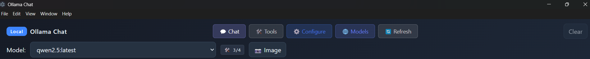
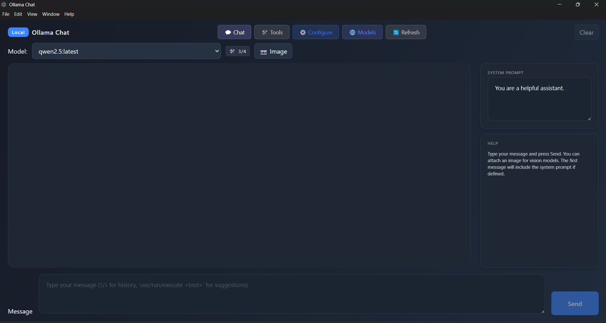
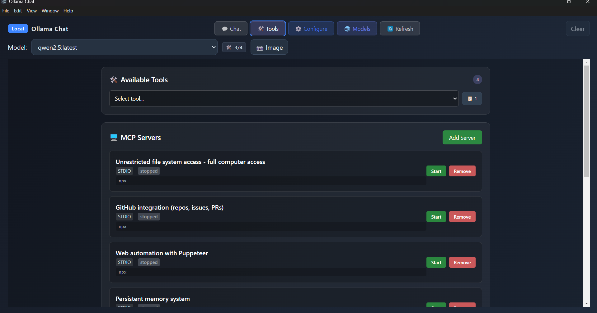
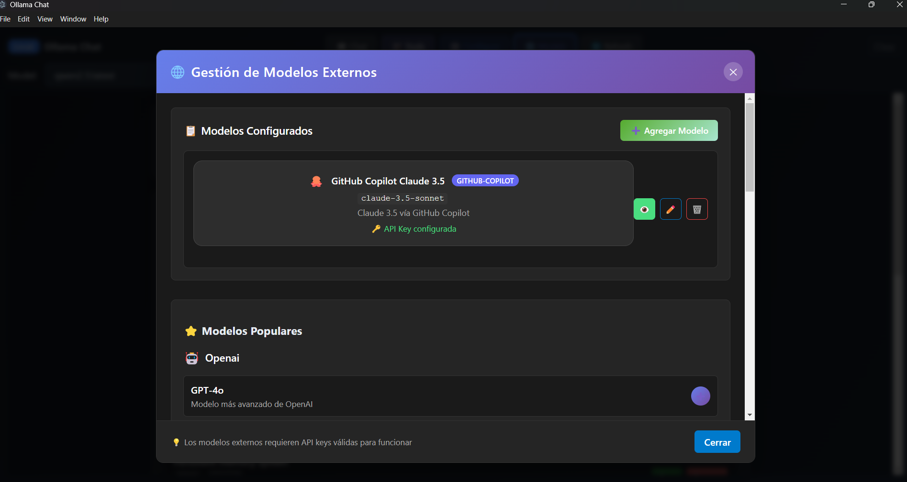
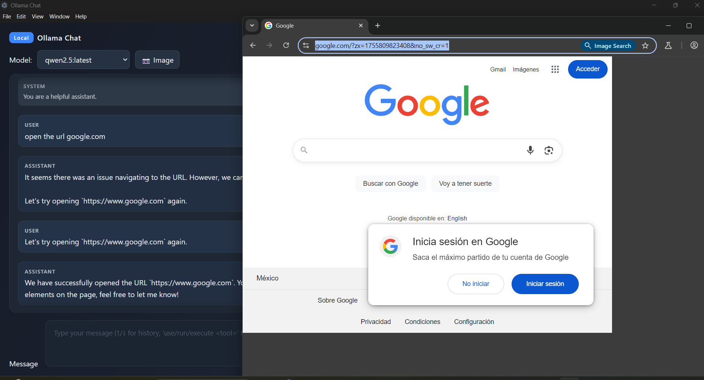

# Ollama Chat with MCP Integration

A modern, feature-rich chat application built with Electron, React, and TypeScript that integrates with Ollama for local AI inference and Model Context Protocol (MCP) for extended functionality.



## 📸 Screenshots

### Main Chat Interface

*The main chat interface showing conversation with an AI model and tool usage*

### Tool Management

*Tool management interface where you can configure and monitor MCP tools*

### Model Configuration

*Model selection and configuration interface with external model support*

### Web Automation Example

*Example of web automation using Puppeteer tools for screenshot capture*

## 🎥 Video Demo

📹 **[Watch the Complete Navigation Guide](./docs/videos/navigation-demo.mp4)**

*A comprehensive video demonstrating:*
- Initial setup and installation
- Basic chat functionality
- Tool integration and usage
- Advanced features walkthrough
- Troubleshooting common issues

### Creating Your Own Demo Video

To create a navigation demo video for this application:

1. **Recording Setup**
   - Use screen recording software (OBS Studio, Camtasia, or built-in tools)
   - Set recording resolution to 1920x1080 for clarity
   - Ensure good audio quality for narration

2. **Demo Script Structure**
   ```
   1. Introduction (30s)
      - Welcome and app overview
      - Key features highlight
   
   2. Installation & Setup (2-3 min)
      - Prerequisites installation
      - App installation process
      - First-time configuration
   
   3. Basic Features (3-4 min)
      - Chat interface tour
      - Model selection
      - System prompts
      - Image upload
   
   4. MCP Tools (4-5 min)
      - Tools tab overview
      - Filesystem operations
      - Web automation examples
      - GitHub integration
   
   5. Advanced Features (2-3 min)
      - External model configuration
      - Tool management
      - Settings and customization
   
   6. Troubleshooting (1-2 min)
      - Common issues and solutions
      - Where to get help
   
   7. Conclusion (30s)
      - Summary and next steps
   ```

3. **Recording Tips**
   - Speak clearly and at a moderate pace
   - Use cursor highlighting to guide attention
   - Include actual examples and use cases
   - Show both successful operations and error handling
   - Keep segments focused and concise

## 🚀 Features

### Core Features

- **Local AI Chat**: Chat with Ollama models running locally on your machine
- **Modern UI**: Clean, responsive interface with tabs for chat and tools
- **Image Support**: Upload and analyze images with vision-capable models
- **Model Selection**: Easy switching between installed Ollama models
- **System Prompts**: Customize AI behavior with custom system prompts

### MCP Integration

- **Filesystem Tools**: Read, write, and navigate files and directories
- **GitHub Integration**: Search repositories, manage issues, create PRs
- **Web Automation**: Use Puppeteer for web scraping and automation
- **Memory System**: Persistent knowledge graph for remembering context
- **Search Capabilities**: Web search integration (with API key)

### Developer Experience

- **TypeScript**: Full type safety throughout the application
- **Clean Architecture**: Domain-driven design with clear separation of concerns
- **Hot Reload**: Development server with instant updates
- **Testing Ready**: Jest configuration for unit testing
- **Linting**: ESLint and Prettier for code quality

## 📸 Taking Screenshots for Documentation

To capture screenshots for this README:

### Required Screenshots

1. **Main Interface** (`main-interface.png`)
   - Start the app with `npm start`
   - Open a chat with an AI model
   - Show a conversation with tool usage
   - Include the full window with tabs visible

2. **Tool Management** (`tools-tab.png`)
   - Click on the "Tools" tab
   - Show the list of available tools
   - Include enabled/disabled status
   - Capture tool categories and descriptions

3. **Model Configuration** (`model-config.png`)
   - Click on "Models" tab
   - Show model selection dropdown
   - Include any external models if configured
   - Show system prompt area

4. **Web Automation Example** (`web-automation.png`)
   - Run a Puppeteer command like "take a screenshot of google.com"
   - Show the command execution
   - Include the resulting screenshot or output
   - Capture the full conversation flow

### Screenshot Guidelines

- **Resolution**: Capture at least 1920x1080
- **Format**: Save as PNG for best quality
- **Content**: Include relevant UI elements and text
- **Privacy**: Blur any personal information
- **Lighting**: Use dark/light mode consistently
- **File Size**: Optimize images to keep under 500KB each

## 🛠️ Technology Stack

- **Frontend**: React 18, TypeScript, Vite
- **Backend**: Electron, Node.js
- **AI**: Ollama (local inference)
- **Tools**: Model Context Protocol (MCP)
- **Styling**: CSS3 with modern features
- **Testing**: Jest
- **Build**: TypeScript compiler, Vite bundler

## 📋 Prerequisites

### Required
- **Node.js** 18+ and npm
- **Ollama** installed and running locally
- **Compatible AI Model** with tool support (see supported models below)

### Supported Models for MCP Tools
For full MCP functionality, you need a model that supports function calling:

#### Highly Recommended
- `llama3.1` (8b, 70b, 405b) - Excellent tool support
- `qwen2.5` (7b, 14b, 32b, 72b) - Great performance with tools

#### Recommended
- `mistral-nemo` (12b) - Good tool support
- `mistral-large` (123b) - Advanced capabilities

#### Install a compatible model:
```bash
# Best option for most users
ollama pull llama3.1:8b

# Alternative options
ollama pull qwen2.5:7b
ollama pull mistral-nemo
```

## 🚀 Quick Start

### 1. Clone and Install
```bash
git clone <repository-url>
cd ollama-chat
npm install
```

### 2. Setup MCP Servers
```bash
# Install MCP servers globally
npm run mcp:setup
```

### (New) Full Automatic Setup

If you prefer the project to install everything (Ollama, base model and MCP servers) run:

```bash
npm run setup:full
```

This script will:

1. Install Ollama (winget / brew / official script) if missing
2. Verify/start the Ollama service
3. Pull the base model `llama3.1:8b` if absent
4. Install common MCP servers globally
5. Generate `mcp-servers.json` and `.env.example` (if missing)
6. Show next steps

If automatic Ollama installation fails (winget missing or permission issues), install it manually from <https://ollama.com/download> and re-run the script.

### 3. Build and Run

```bash
# Development mode
npm run dev

# Production build
npm run build
npm start
```

## 🔧 Configuration

### MCP Servers Configuration

The application automatically configures MCP servers on first run. Configuration is stored in `mcp-servers.json`:

```json
{
  "mcpServers": {
    "filesystem": {
      "command": "npx",
      "args": ["@modelcontextprotocol/server-filesystem", "/path/to/allowed/directory"],
      "enabled": true
    },
    "github": {
      "command": "npx",
      "args": ["@modelcontextprotocol/server-github"],
      "enabled": true
    }
  }
}
```

### Environment Variables (Optional)

Create a `.env` file for additional configuration:
```env
OLLAMA_BASE_URL=http://localhost:11434
BRAVE_API_KEY=your_brave_search_api_key
```

## 🎯 Usage

### Basic Chat

1. Launch the application
2. Select an Ollama model from the dropdown
3. Type your message and press Enter or click Send
4. Use the system prompt field to customize AI behavior

### Using MCP Tools

When using a compatible model (llama3.1, qwen2.5, etc.), the AI can automatically use tools:

#### Filesystem Operations

```text
"List files in the current directory"
"Read the content of package.json"
"Create a new file called test.txt with some content"
```

#### GitHub Integration

```text
"Search for React repositories on GitHub"
"Show me issues in the microsoft/vscode repository"
"Create a new issue in my repository"
```

#### Web Automation

```text
"Take a screenshot of google.com"
"Navigate to GitHub and extract the main navigation links"
```

#### Memory System

```text
"Remember that I prefer TypeScript over JavaScript"
"What do you know about my preferences?"
"Store this information: I work on web development projects"
```

### Tools Tab

- View all available MCP tools and their status
- Manually execute tools with custom parameters
- Monitor tool execution results

## 🏗️ Project Structure

```text
src/
├── main/                    # Electron main process
│   └── electron-main.ts     # Main entry point, IPC handlers
├── preload/                 # Electron preload scripts
│   └── preload.ts          # Secure API bridge
├── renderer/                # React frontend
│   ├── main.tsx            # React app entry point
│   ├── components/         # React components
│   └── styles.css          # Application styles
└── shared/                  # Shared code
    ├── domain/             # Domain models and interfaces
    │   ├── chat.ts         # Chat-related types
    │   └── mcp.ts          # MCP-related types
    └── infrastructure/     # Implementation layer
        ├── mcp/            # MCP integration
        │   └── McpManager.ts # MCP server management
        └── ollama/         # Ollama integration
            └── OllamaClient.ts # Ollama API client
```

## 🧪 Development

### Available Scripts

```bash
npm run dev          # Development with hot reload
npm run build        # Production build
npm run build:clean  # Clean build directory
npm run test         # Run tests
npm run lint         # Lint code
npm run format       # Format code with Prettier
npm run mcp:setup    # Install MCP servers
npm run setup:full   # Full auto setup (Ollama + model + MCP)
npm run package:win  # Build Windows installers (NSIS + MSI)
npm run package:msi  # Build only MSI (Windows)
```

### Development Workflow

1. Run `npm run dev` for development with hot reload
2. Use `npm run lint` to check code quality
3. Run `npm test` for unit tests
4. Build with `npm run build` before release

## 🐛 Troubleshooting

### Windows MSI Build Issues

If the MSI build fails:

- Ensure **WiX Toolset v3.14+** is installed (add its binaries to PATH)
- Run in PowerShell: `light.exe -?` to verify
- Use: `npm run package:msi`
- Clear cache if artifacts look corrupted: remove `dist/` before retrying


### Common Issues

#### "Model does not support tools"

- Your current model doesn't support function calling
- Install a compatible model: `ollama pull llama3.1:8b`
- The app will show a warning and work without tools

#### MCP Servers not starting

- Check that Node.js and npm are in your PATH
- Ensure MCP packages are installed: `npm run mcp:setup`
- Check console logs for specific error messages

#### Ollama connection issues

- Verify Ollama is running: `ollama list`
- Check Ollama is accessible at `http://localhost:11434`
- Restart Ollama service if needed

#### Performance issues

- Use smaller models (8b instead of 70b) for better performance
- Limit the number of active MCP servers
- Ensure sufficient RAM for your chosen model

## 🤝 Contributing

### Code Contributions

1. Fork the repository
2. Create a feature branch: `git checkout -b feature/new-feature`
3. Make your changes and test thoroughly
4. Run linting and tests: `npm run lint && npm test`
5. Commit with clear messages: `git commit -m "feat: add new feature"`
6. Push and create a Pull Request

### Documentation Contributions

#### Screenshots

To contribute or update screenshots:

1. Follow the [Screenshot Guide](./docs/SCREENSHOT_GUIDE.md)
2. Capture high-quality images as specified
3. Optimize images to under 500KB each
4. Place in `docs/images/` directory
5. Update README links accordingly

#### Video Demo

To create or update the navigation video:

1. Follow the [Video Creation Guide](./docs/VIDEO_GUIDE.md)
2. Record in 1080p with clear audio
3. Keep video under 15 minutes total length
4. Place in `docs/videos/` directory
5. Consider uploading to YouTube for large files

#### Documentation Standards

- Use clear, concise language
- Include practical examples
- Test all provided code samples
- Maintain consistent formatting
- Update both README and relevant guides

## 📄 License

This project is licensed under the MIT License - see the [LICENSE](LICENSE) file for details.

## 🙏 Acknowledgments

- [Ollama](https://ollama.ai/) - Local AI inference
- [Model Context Protocol](https://modelcontextprotocol.io/) - Tool integration standard
- [Electron](https://www.electronjs.org/) - Desktop app framework
- [React](https://reactjs.org/) - Frontend framework
