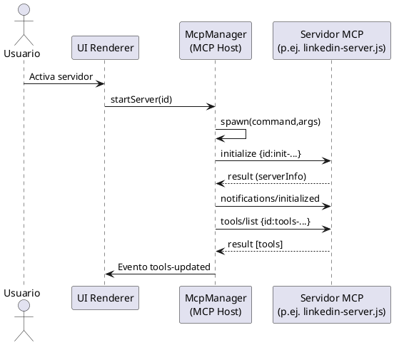
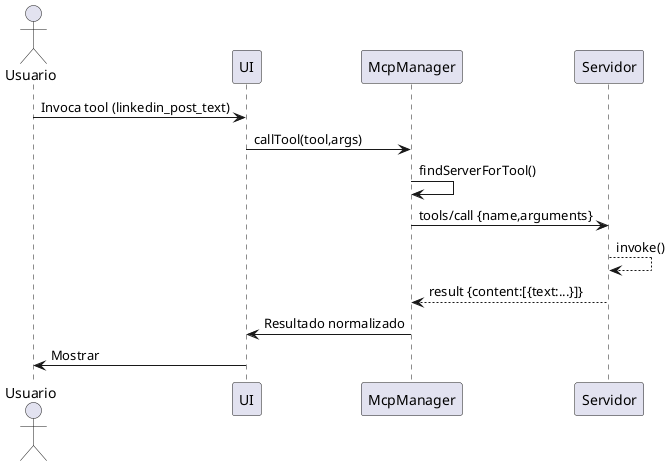

# MCP Architecture in ollama-chat

This document explains how the app acts as the **MCP host** and how **MCP servers (clients)** integrate with it.

## Componentes Principales

- **MCP Host**: `src/shared/infrastructure/mcp/McpManager.ts`
  - Loads configuration (`mcp-servers.json`, `mcp-config-simple.json`, etc.).
  - Spawns server processes via `spawn` (stdio JSON-RPC).
  - Performs handshake: `initialize` → `notifications/initialized` → `tools/list`.
  - Manages tool concurrency queue, timeouts, and line-by-line JSON parsing.
  - Exposes built‑in safe filesystem tools: `list_dir`, `read_file`, `write_file`, `path_info`.

- **MCP Servers (clients)**: under `integration-servers/` and `unsafe-servers/`.
  - Reusable base: `integration-servers/base-jsonrpc-server.js` (implements `initialize`, `tools/list`, `tools/call`).
  - Examples: `spotify-server.js`, `facebook-instagram-server.js`, `outlook-server.js`, `linkedin-server.js`, `puppeteer-server.js`.
  - Potentially dangerous servers (disabled by default): `unsafe-servers/system-access-server.js`, `unsafe-servers/process-control-server.js`.

## Flujo de Inicio (Handshake)



ASCII:

```text
Usuario -> UI -> McpManager -> (spawn) Server
McpManager => Server: initialize
Server => McpManager: result
McpManager => Server: notifications/initialized
McpManager => Server: tools/list
Server => McpManager: tools[]
McpManager => UI: tools-updated
```

## Executing a Tool



## Tool Using an External API (LinkedIn)

```plantuml
@startuml
participant McpManager as Host
participant "linkedin-server.js" as S
participant "LinkedIn API" as API
Host -> S: tools/call linkedin_post_text {text}
S -> S: postText() prepara body
S -> API: POST /ugcPosts (Bearer LINKEDIN_ACCESS_TOKEN)
API --> S: 201 + JSON (urn del post)
S --> Host: result {content:[{text:'{...json...}'}]}
Host --> (UI): Resultado
@enduml
```

## States and Errors

- Per‑request timeout: handled in `sendJsonRpcRequest` (`MCP_TIMEOUT` env, default 300000 ms).
- Concurrency: `runWithConcurrency` limits simultaneous calls (`MCP_MAX_CONCURRENT_TOOLS`).
- Multi‑line JSON: buffered with `partialJson` until valid parse.
- Server not ready: calls fail if state != `ready`.
- Restart: when process exits it becomes `stopped`; you can call `startServer(id)` again.

## Adding a New Server

1. Create a file (e.g. `integration-servers/my-server.js`) using `base-jsonrpc-server.js`.
2. Define a `tools` array with objects `{ name, description, inputSchema, invoke }`.
3. Add an entry to `mcp-servers.json` (set `enabled: false` initially).
4. Activate via the UI or programmatically with `startServer`.

## LinkedIn Server (New)

File: `integration-servers/linkedin-server.js`
Tools:

- `linkedin_generate_auth_url`: generate OAuth2 URL.
- `linkedin_exchange_code`: exchange code for access token.
- `linkedin_profile`: GET /me.
- `linkedin_post_text`: publish simple text post.

Environment variables:

```bash
LINKEDIN_CLIENT_ID
LINKEDIN_CLIENT_SECRET
LINKEDIN_REDIRECT_URI
LINKEDIN_SCOPES (default r_liteprofile w_member_social)
LINKEDIN_ACCESS_TOKEN (after exchange)
```

## External Placeholder Model: ChatGPT 5

A disabled placeholder model (`gpt-5`) is automatically added in `ExternalModelManager.ensureBaselineModels()` (`src/main/external-models.ts`) so it can be enabled once it becomes available.

## Key Files Summary

| Rol | Archivo |
|-----|---------|
| MCP Host | `src/shared/infrastructure/mcp/McpManager.ts` |
| Base JSON-RPC server | `integration-servers/base-jsonrpc-server.js` |
| LinkedIn example | `integration-servers/linkedin-server.js` |
| Server config | `mcp-servers.json` |
| Dangerous servers | `unsafe-servers/*.js` |
| External models | `src/main/external-models.ts` |

## Potential Future Extensions

- WebSocket/HTTP transport for remote servers.
- Partial streaming for tool results.
- Health monitoring (heartbeat) & auto‑restart.
- Caching for idempotent tool results.

---
Last updated: 2025-08-24
